# Victorian Crime & Justice Intelligence Analytics Platform

Public-sector analytics portfolio using official Crime Statistics Agency and Australian Bureau of Statistics open data.

**Stage 1** recorded offences. **Stage 2** criminal incidents, alleged offender incidents, quality scoring and Streamlit. **Stage 3** ABS Recorded Crime – Offenders, automated briefing, preserved data-request log, documentation and a usable MySQL star-schema load.

Recorded offences, criminal incidents, alleged offender incidents and ABS unique offenders are **different statistical products**. They are not interchangeable.

## What the platform delivers

| Deliverable | Location |
|---|---|
| Official CSA and ABS workbooks | `data/raw/` via `src/ingestion/download.py` |
| SQL analysis | `sql/crime_analysis.sql`, `stage2_analysis.sql`, `stage3_analysis.sql` |
| Python analytics | `src/analytics/` including `national.py` |
| Visualisations | 27 charts in `reports/generated/figures/` (shown below) |
| Interactive dashboards | `dashboard/tableau-public/Victorian_Crime_Justice_Dashboard.html` and `.twbx` |
| Notebooks | `notebooks/01`–`11` |
| Data-quality score | `reports/generated/data_quality_report.html` |
| Streamlit data requests | `app/streamlit_app.py` |
| Tableau Public dashboards | `dashboard/tableau-public/` |
| Optional MySQL star schema | `docker-compose.yml`, `sql/schema.sql`, `src/database/load_data.py` |
| Documentation | `docs/architecture.md`, `data_dictionary.md`, `methodology.md`, `data_quality.md`, `ethics_governance_and_decisions.md` |
| Tests | `tests/test_transformations.py`, `tests/test_stage3.py` |

## Data sources and download links

Publisher: **Crime Statistics Agency (Victoria)**. Licence: [CC BY 4.0](https://creativecommons.org/licenses/by/4.0/). Publication date: 19 June 2026.

### Recorded offences

https://discover.data.vic.gov.au/dataset/data-tables-recorded-offences

- [Statewide](https://files.crimestatistics.vic.gov.au/2026-06/Data_Tables_Recorded_Offences_Visualisation_Year_Ending_March_2026.xlsx)
- [By LGA](https://files.crimestatistics.vic.gov.au/2026-06/Data_Tables_LGA_Recorded_Offences_Year_Ending_March_2026.xlsx)

### Criminal incidents

https://discover.data.vic.gov.au/dataset/criminal-incident

- [Statewide](https://files.crimestatistics.vic.gov.au/2026-06/Data_Tables_Criminal_Incidents_Visualisation_Year_Ending_March_2026.xlsx)
- [By LGA](https://files.crimestatistics.vic.gov.au/2026-06/Data_Tables_LGA_Criminal_Incidents_Year_Ending_March_2026.xlsx)

### Alleged offender incidents

https://discover.data.vic.gov.au/dataset/data-tables-alleged-offender-incidents

- [Statewide](https://files.crimestatistics.vic.gov.au/2026-06/Data_Tables_Alleged_Offender_Incidents_Visualisation_Year_Ending_March_2026.xlsx)
- [By LGA](https://files.crimestatistics.vic.gov.au/2026-06/Data_Tables_LGA_Alleged_Offenders_Year_Ending_March_2026.xlsx)

### ABS Recorded Crime – Offenders

https://www.abs.gov.au/statistics/people/crime-and-justice/recorded-crime-offenders/latest-release

- [Offenders, Australia](https://www.abs.gov.au/statistics/people/crime-and-justice/recorded-crime-offenders/2024-25/1.%20Offenders%2C%20Australia.xlsx)
- [Offenders, states and territories](https://www.abs.gov.au/statistics/people/crime-and-justice/recorded-crime-offenders/2024-25/2.%20Offenders%2C%20states%20and%20territories.xlsx)
- [Youth offenders](https://www.abs.gov.au/statistics/people/crime-and-justice/recorded-crime-offenders/2024-25/3.%20Youth%20offenders.xlsx)

ABS counts **unique alleged offenders proceeded against** in a financial year. That is not CSA alleged offender incidents.

## Key results (year ending March 2026)

### Recorded offences
- **625,426** offences; rate **8,690.8** per 100,000; **+15.4%** since 2017

### Criminal incidents
- **468,711** incidents (**−1.0%** on 2025; **+12.6%** since 2017)
- About **1.3 recorded offences per criminal incident**
- Charge status: **55.6%** unsolved, **30.1%** charges laid, **14.3%** no charges laid

### Alleged offender incidents
- **195,342** alleged offender incidents (**+8.6%** on 2025; **+20.4%** since 2017)
- Among known sex: **78.4%** male, **21.6%** female
- Youth (ages 10–17): **22,654** incidents (**11.7%**); peak single year of age is **16**
- Leading principal offences: theft, assault, breaches of orders
- Highest alleged-offender **rate** LGA: **Latrobe** (not Melbourne)

These are alleged incidents, not unique people and not findings of guilt.

### ABS unique offenders (financial year 2024–25)
- Victoria: **59,693** offenders; rate **961.6** per 100,000 aged 10+ (**−3.0%** on 2023–24)
- Australia: **344,620** offenders; rate **1,419.8**
- Victoria’s rate is **67.7%** of the national rate and the lowest among the six states
- Victorian youth (10–17): **7,644** (**12.8%** of Victorian offenders)

Do not treat 59,693 ABS offenders as comparable to 195,342 CSA alleged offender incidents.

Overall loaded-table data-quality score: **100.0%** on CSA tables after ingest (missing counts, negatives and duplicate business keys were not found).

## Interactive Tableau dashboards

Open the published files in this repository:

- [Interactive HTML dashboard](dashboard/tableau-public/Victorian_Crime_Justice_Dashboard.html)
- [Tableau workbook (.twbx)](dashboard/tableau-public/Victorian_Crime_Justice.twbx)

The HTML file is a five-tab public dashboard (year filter, metro/regional filter, hover tooltips). The `.twbx` file opens in Tableau Desktop 2026.2 and can be saved to Tableau Public. See `docs/tableau_guide.md`.

**Overview.** Statewide recorded offences reached 625,426 in 2026 (rate 8,690.8 per 100,000). The long rise from 2017 (+15.4%) paused in the latest year (−0.2%). This tab keeps recorded offences, criminal incidents (468,711) and alleged offender incidents (195,342) as three series so they are not added together.

**Geographic intelligence.** Melbourne leads recorded-offence *counts* as an activity centre (45,561 offences; rate 23,304 per 100,000). Compare LGAs with *rates*. The highest alleged-offender rate LGA in 2026 is Latrobe, not Melbourne. Metropolitan / regional is an analytical grouping, not official CSA geography.

**Offenders and justice.** Alleged offender incidents rose 8.6% in 2026 while recorded offences were flat. Known sex is 78.4% male and 21.6% female. Youth aged 10–17 account for 22,654 incidents (11.7%), peaking at age 16. Charge status: 55.6% unsolved, 30.1% charges laid, 14.3% no charges laid. These are alleged incidents, not unique people and not findings of guilt.

**National comparison.** ABS unique alleged offenders proceeded against in 2024–25: Victoria 59,693 (rate 961.6 per 100,000 aged 10+), Australia rate 1,419.8. Victoria has the lowest rate of the six states. Do not compare 59,693 with CSA’s 195,342 alleged offender incidents.

**Data quality.** Loaded-table score 100.0% on the current extracts (missing counts, negatives and duplicate business keys were not found). The score describes ingested tables, not police recording practice.

## Visualisations

Charts below are official CSA (year ending March) and ABS (financial year) aggregates. Each figure is also in `reports/generated/figures/`.

### Recorded offences

#### 1. Statewide recorded offences and rate

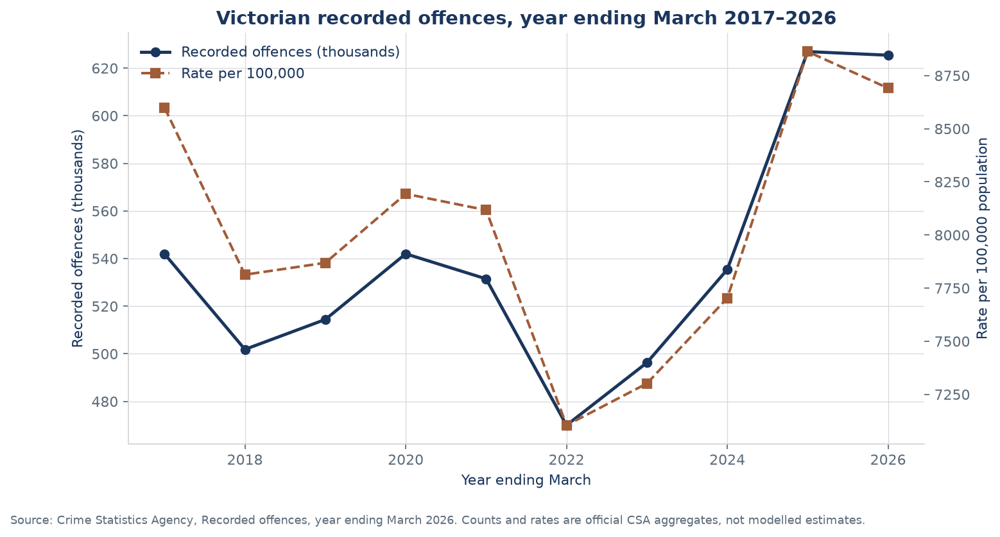

Victoria recorded 625,426 offences in the year ending March 2026, a rate of 8,690.8 per 100,000. The series is 15.4% above 2017. The dual axis keeps volume and rate visible together so a rise in counts is not mistaken for a rise in rate, or the reverse.

#### 2. Year-on-year change in recorded offences

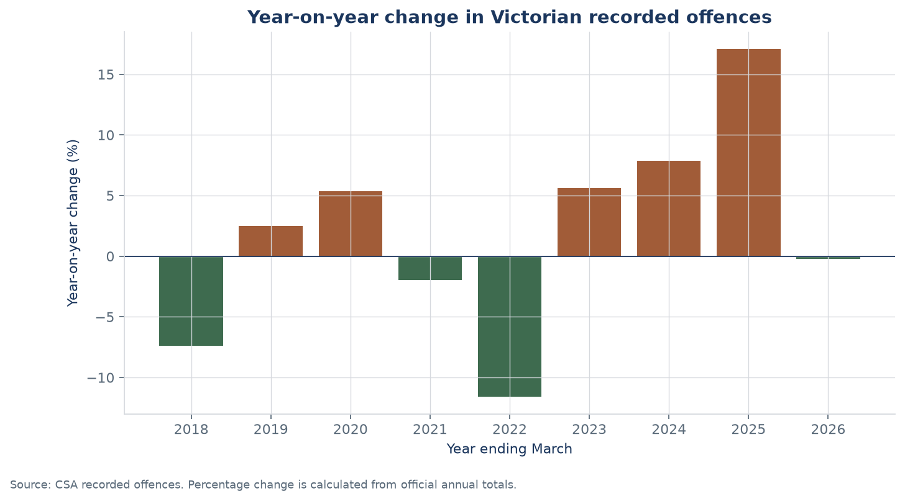

The latest year is a pause, not another surge: offences were 0.2% lower than 2025 after a 17.1% jump into 2025. Year-on-year bars show which reporting years drove the decade-long increase.

#### 3. Offence divisions over time

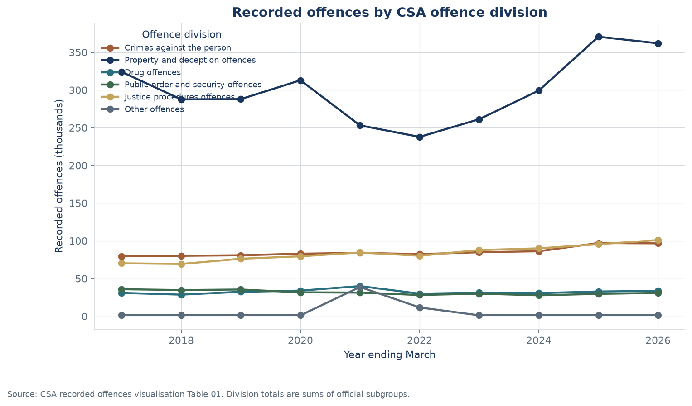

Property and deception remains the largest division. Justice procedures offences had the largest long-term rise (+43.8% from 2017 to 2026). Division lines are kept separate so one category cannot be read as “all crime”.

#### 4. Offence composition, latest year

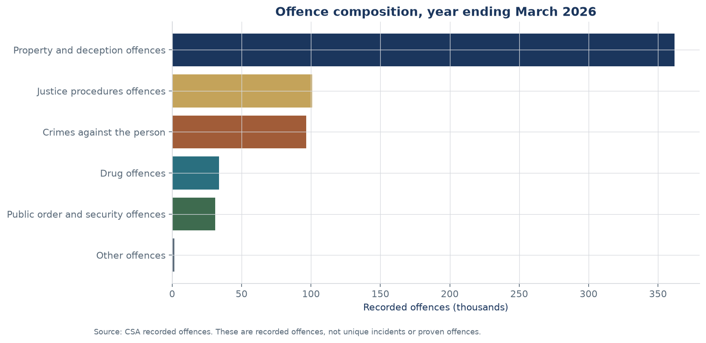

In 2026, property and deception accounted for 57.9% of recorded offences. The mix chart is the right place to talk about *what kind* of offending is recorded, not whether Victoria is “high crime” relative to another state.

#### 5. Fastest-changing subdivisions, 2017 to 2026

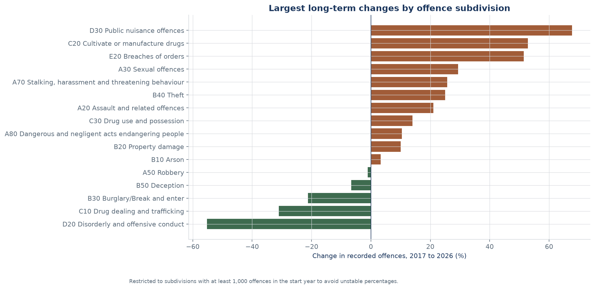

Subdivision change highlights where the long-term movement is concentrated. Use this with the division chart: a large percentage rise on a small base is not the same as a large addition to statewide volume.

#### 6. Highest LGA recorded-offence counts

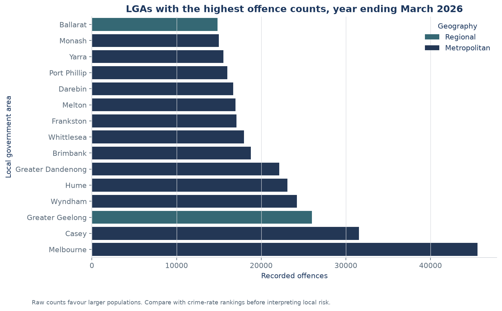

Melbourne leads *counts* (45,561). That is expected for a CBD and night-time activity centre. Count rankings are useful for resourcing busy places and the wrong tool for comparing a small regional LGA with Melbourne.

#### 7. Highest LGA recorded-offence rates

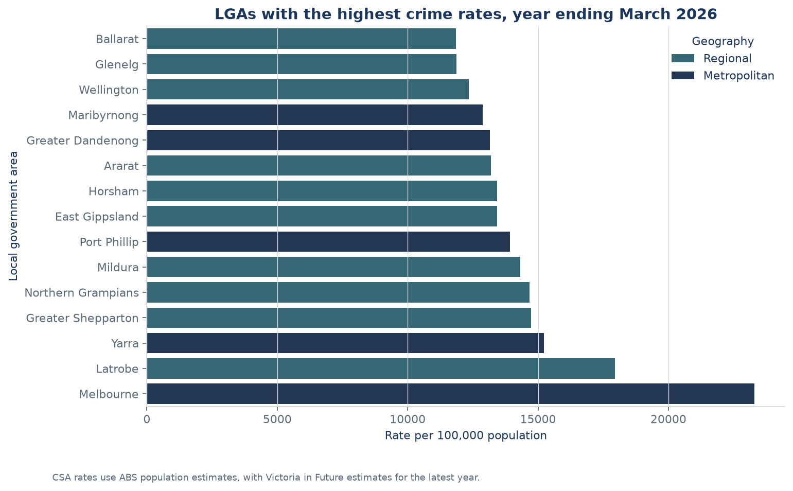

Rates per 100,000 are the comparison measure. Melbourne also has a very high rate (23,304 per 100,000) as well as the highest count. Other LGAs can rank high on rate with far fewer offences.

#### 8. Count versus rate by LGA

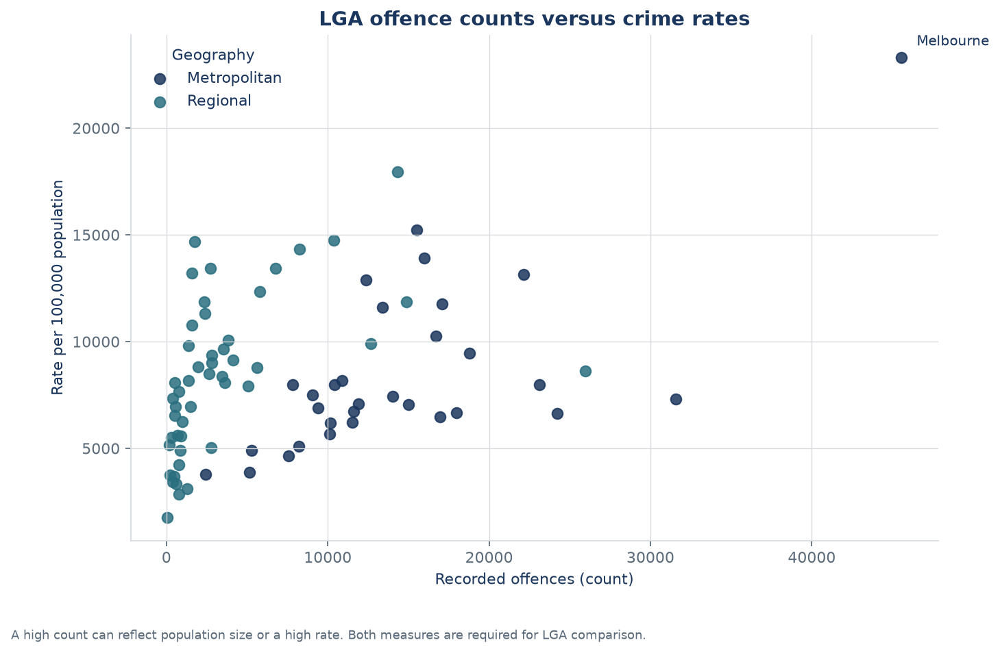

The scatter separates busy LGAs from high-rate LGAs. A place can sit high on count and mid on rate, or the reverse. Pearson correlation between LGA count and rate is about 0.46 and is descriptive only.

#### 9. Metropolitan and regional recorded offences

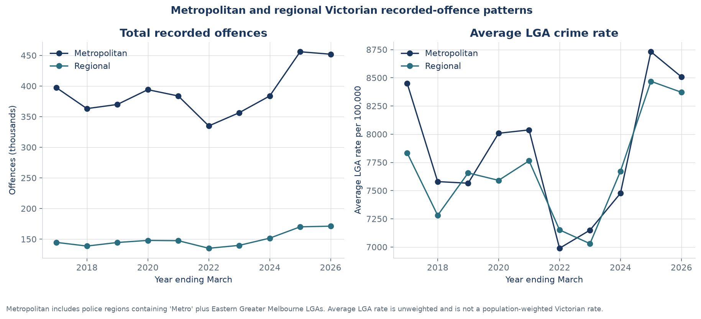

Metropolitan and regional is an analytical grouping: police region contains “Metro”, plus seven Eastern LGAs (Boroondara, Manningham, Monash, Whitehorse, Knox, Maroondah, Yarra Ranges). It is not official CSA geography.

#### 10. Largest LGA year-on-year changes

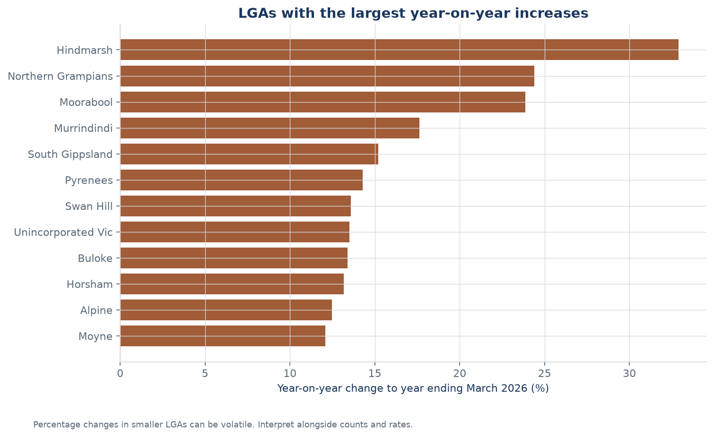

Local year-on-year change finds where the latest reporting year moved most. Small LGAs can show large percentage swings. Read these bars with the rate chart before treating a percentage as a statewide story.

#### 11. Most common offence subgroups, latest year

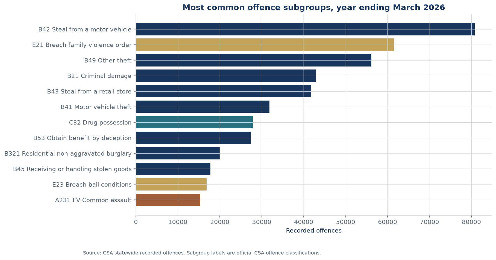

Subgroups are the most detailed CSA offence labels used in this brief. They show what is recorded most often, not what is most serious and not what a court later finds proven.

#### 12. Investigation status

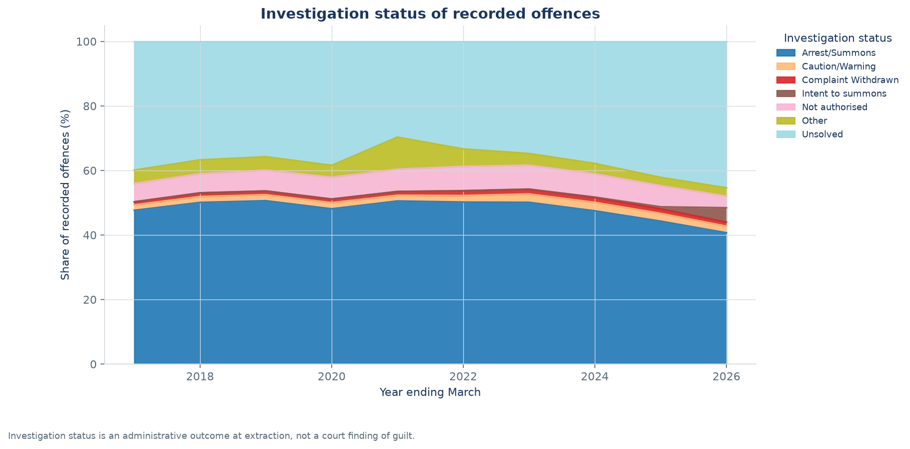

In 2026, 45.4% of recorded offences had an unsolved investigation status and 40.7% were arrest/summons. Investigation status is an administrative label, not a court outcome.

#### 13. Family-incident related recorded offences

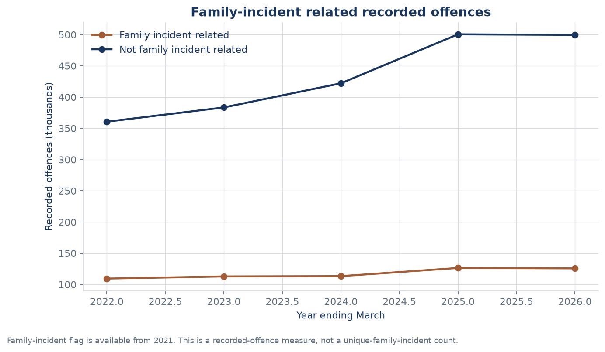

Family-incident related offences were 20.1% of 2026 recorded offences. The flag exists from 2021, so this series must not be stretched back to 2017 as if the share were comparable.

#### 14. Offence mix in high-count LGAs

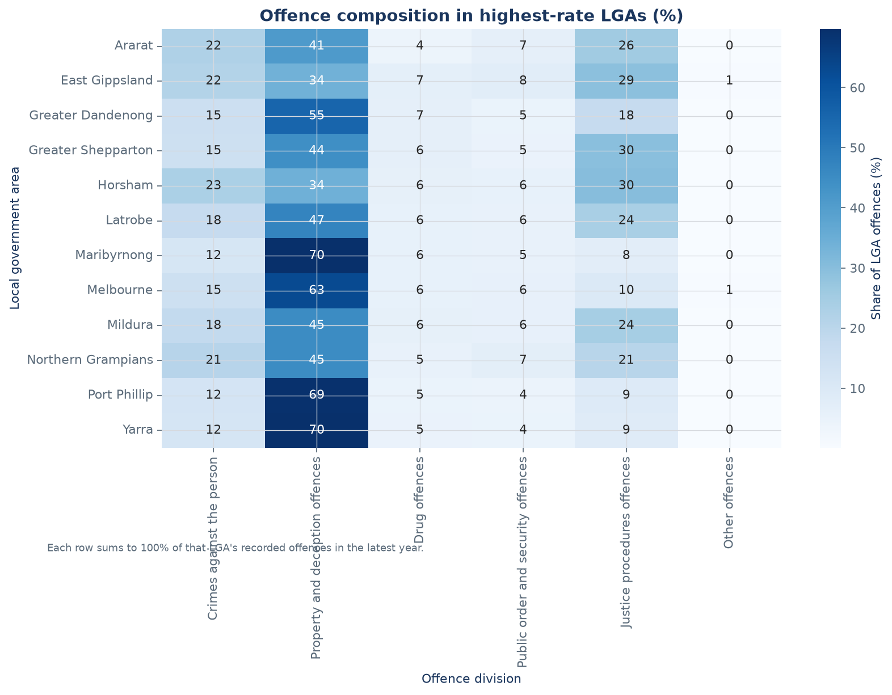

The heatmap shows how offence divisions sit inside the highest-count LGAs. It is a composition view: a dark cell is volume in that LGA and division, not a finding that one community is “more criminal”.

#### 15. Three-year rolling average of recorded offences

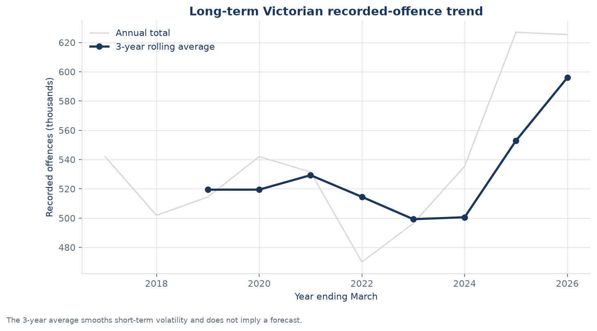

The rolling average smooths single-year jumps (including 2025) so the decade path is easier to brief. It does not replace the official annual totals.

### Criminal incidents and alleged offender incidents

#### 16. Three official CSA products

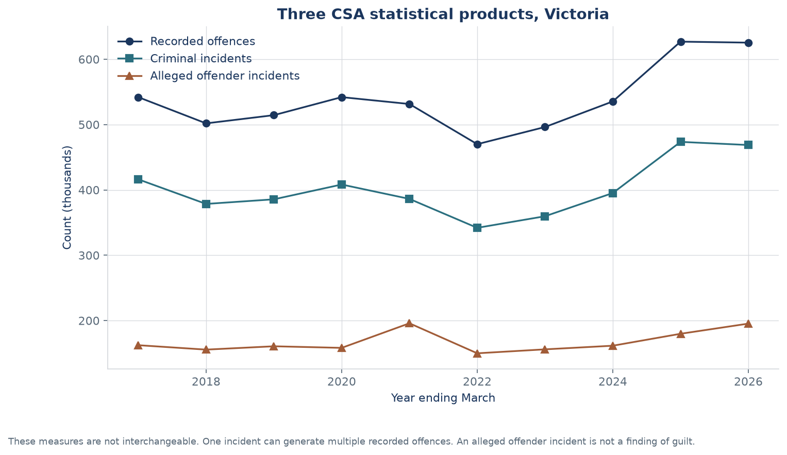

Recorded offences, criminal incidents and alleged offender incidents move together but are not the same unit. In 2026 there were about 1.3 recorded offences per criminal incident. Do not add the three lines into one crime total.

#### 17. Statewide criminal incidents

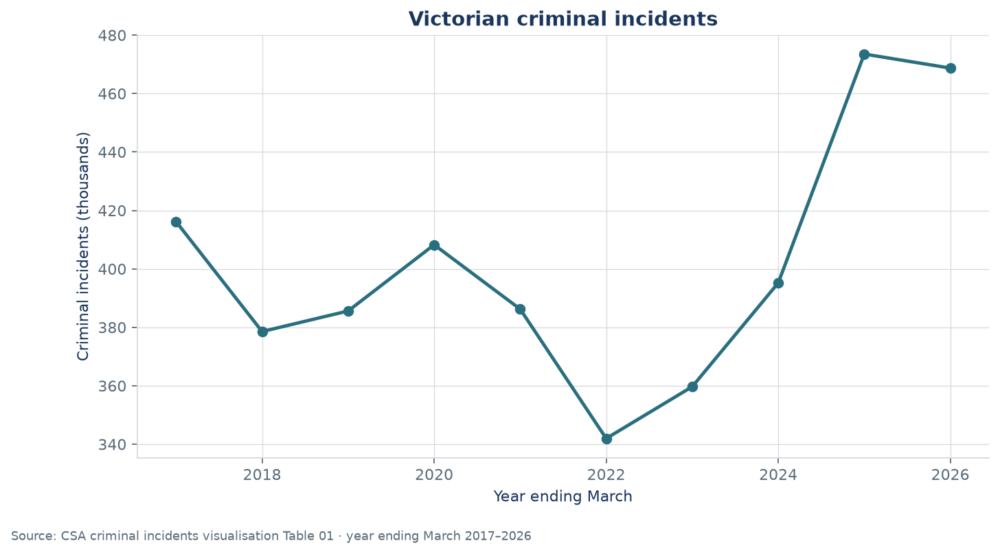

Criminal incidents were 468,711 in 2026 (−1.0% on 2025; +12.6% since 2017). An incident can contain more than one recorded offence, which is why this series sits below the offence total.

#### 18. Criminal incident charge status

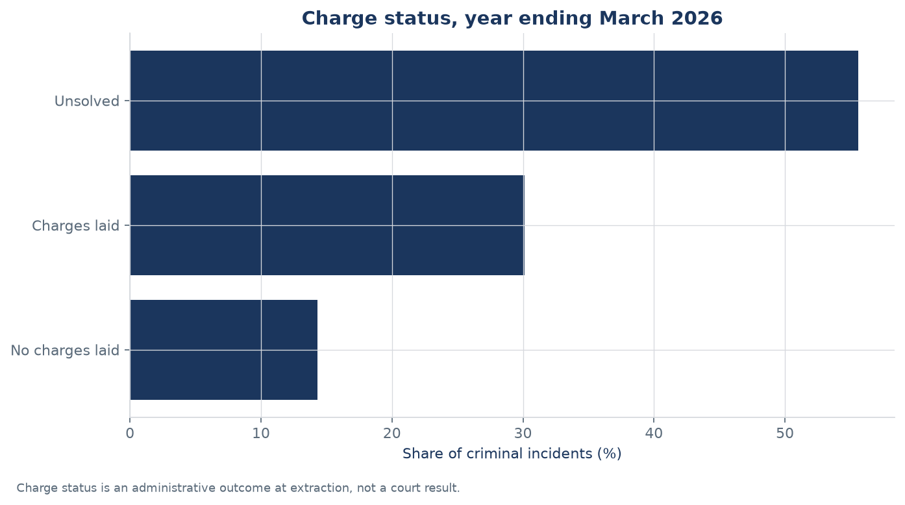

Charge status in 2026: 55.6% unsolved, 30.1% charges laid, 14.3% no charges laid. This is process, not guilt. It should be briefed beside volume when someone asks whether “more crime” is being resolved.

#### 19. Alleged offender incidents

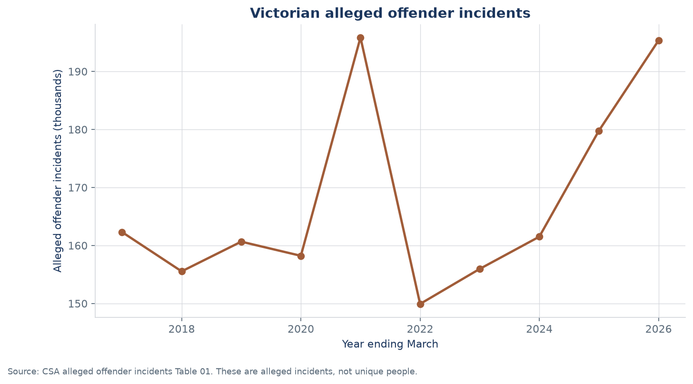

Alleged offender incidents rose to 195,342 in 2026 (+8.6% on 2025; +20.4% since 2017) while recorded offences were slightly down. These are incidents linked to an alleged offender, not unique people.

#### 20. Alleged offender incidents by sex

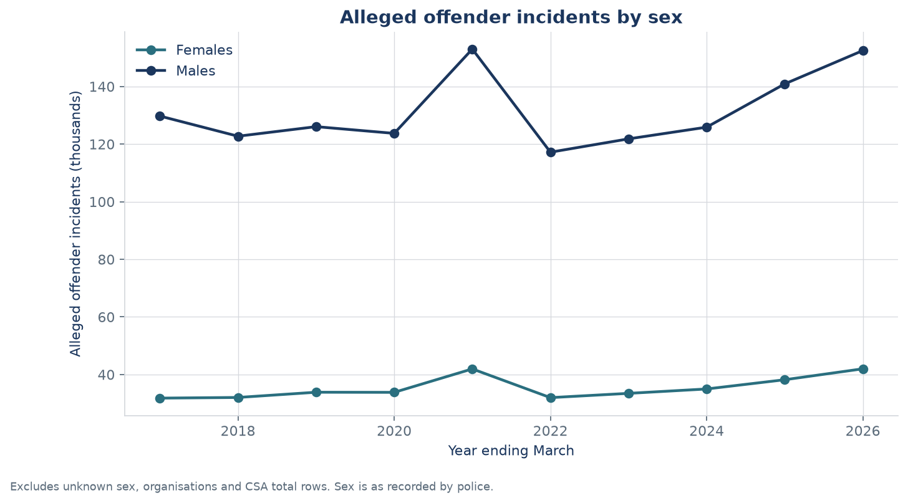

Among known sex, 78.4% of 2026 alleged offender incidents were male and 21.6% female. Unknown sex, organisations and CSA total rows are excluded so the shares are not doubled.

#### 21. Age distribution of alleged offender incidents

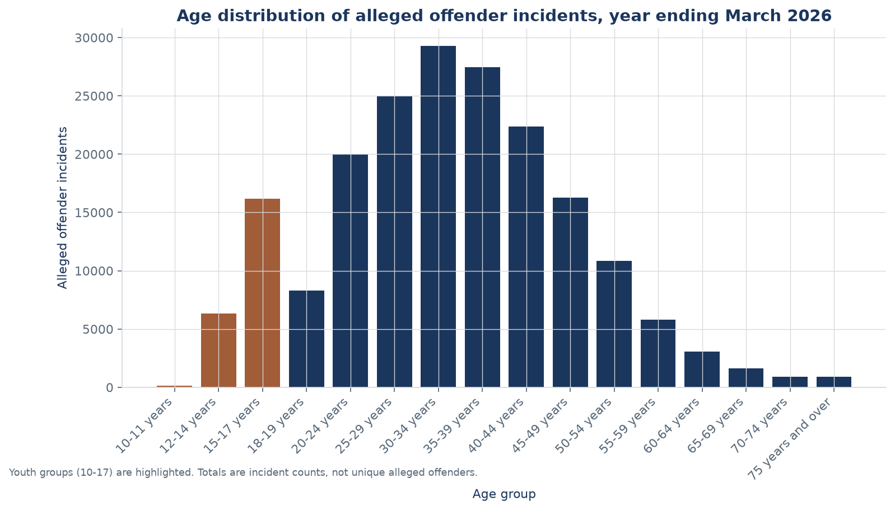

Adult age groups hold most incidents. Youth groups (10–11, 12–14, 15–17) are highlighted. Totals are incident counts, not unique alleged offenders.

#### 22. Youth and adult alleged offender incidents

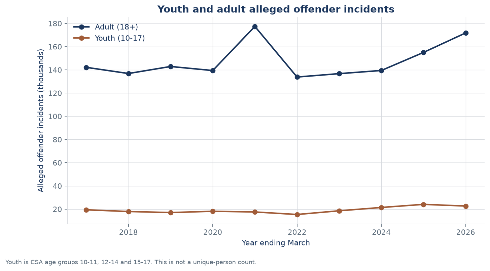

Youth aged 10–17 accounted for 22,654 incidents in 2026 (11.7%). The youth series fell from 24,099 in 2025. Adult incidents remain the larger series and should not be dropped from a youth briefing.

#### 23. Youth alleged offender incidents by single year of age

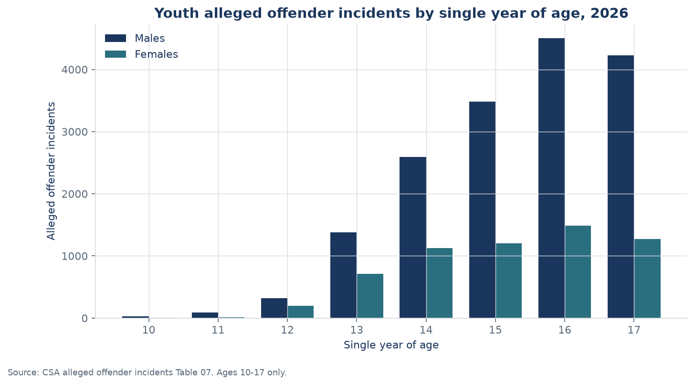

Inside ages 10–17, the peak single year of age is 16 (5,991 incidents). This is the right chart for prevention design within the official youth definition, not a unique-person count.

### ABS Recorded Crime – Offenders

#### 24. ABS offender rates by jurisdiction, 2024–25

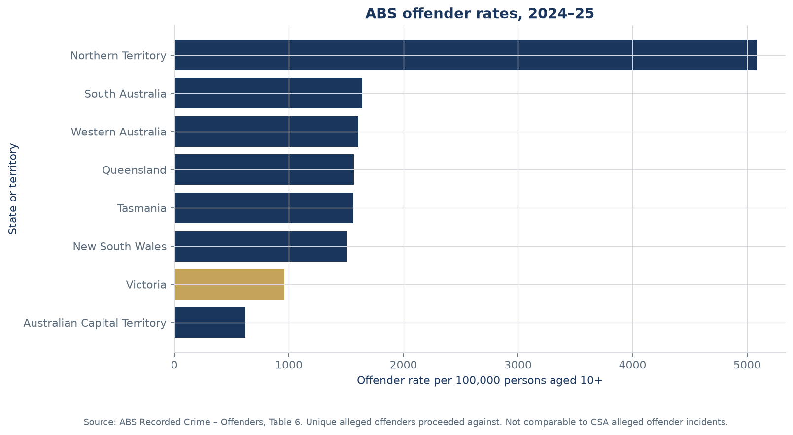

Victoria’s unique-offender rate was 961.6 per 100,000 persons aged 10+, the lowest of the six states (only the ACT is lower). Australia’s rate was 1,419.8. This is not CSA alleged offender incidents.

#### 25. ABS offender rates: Victoria and Australia

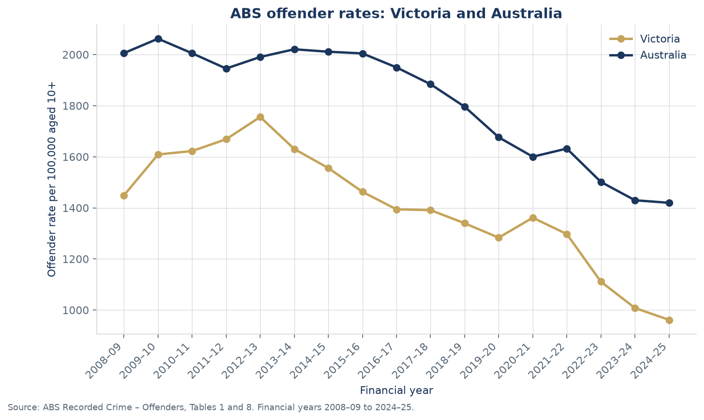

From 2008–09 to 2024–25 Victoria’s rate stayed below the Australian rate. In 2024–25 Victoria was 67.7% of the national rate, with 59,693 unique offenders (−3.0% on 2023–24).

#### 26. ABS Victoria principal offence, 2024–25

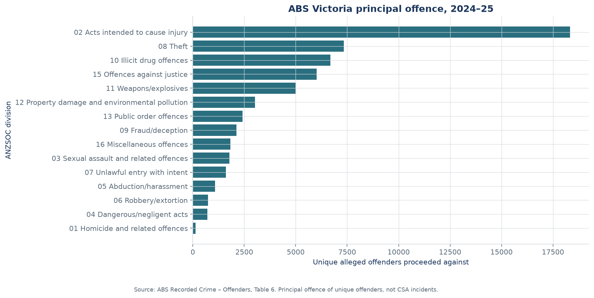

Acts intended to cause injury is the largest ABS principal-offence division for Victoria (18,335 unique offenders). These are ANZSOC principal offences of unique people proceeded against, not CSA incident subdivisions.

#### 27. ABS youth offenders

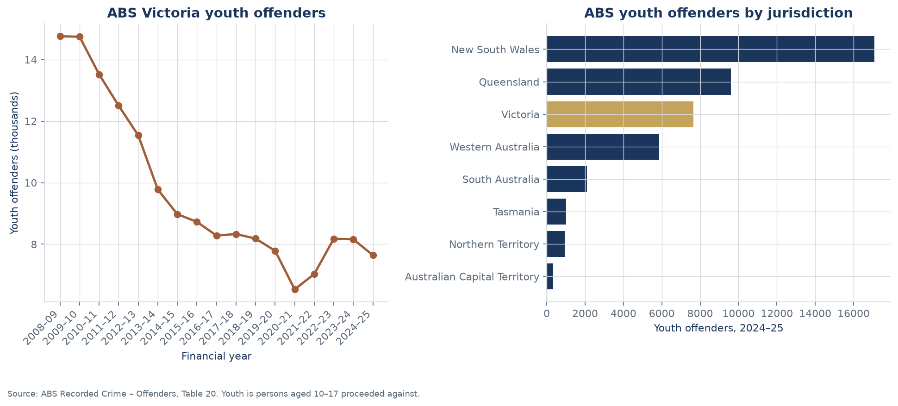

Victoria had 7,644 unique youth offenders aged 10–17 in 2024–25 (12.8% of Victorian ABS offenders). That figure is not CSA’s 22,654 youth *incidents*. The two products have different units and periods.

## Official source files are not in this repository

Excel workbooks, SQLite and CSV extracts stay off git. Download the files listed above (also in `data/README.md`) into `data/raw/` to rebuild the pipeline. Published PNG figures and the Tableau HTML / `.twbx` dashboards *are* in the repository.

## How to run

```bash
cd crime-justice-analytics
python3 -m venv .venv
source .venv/bin/activate
pip install -r requirements.txt
# download official workbooks into data/raw/ (see data/README.md)
export PYTHONPATH=.
python -m src.pipeline
pytest
PYTHONPATH=. streamlit run app/streamlit_app.py
```

Interactive Tableau Public dashboards (HTML you can open now, plus a Tableau workbook to publish):

```bash
PYTHONPATH=. python -m src.dashboard.build
open "dashboard/tableau-public/Victorian_Crime_Justice_Dashboard.html"
open -a "Tableau Desktop (Apple silicon) 2026.2" "dashboard/tableau-public/Victorian_Crime_Justice.twbx"
```

See `docs/tableau_guide.md` for the five dashboard tabs and how to **Save to Tableau Public**.

Refresh ABS tables only:

```bash
PYTHONPATH=. python -m src.pipeline --abs-only
```

Optional MySQL:

```bash
cp .env.example .env
docker compose up -d
PYTHONPATH=. python -m src.database.load_data
```

See `docs/architecture.md` and `docs/methodology.md`.

## Data ethics and governance

See `docs/ethics_governance_and_decisions.md` for the executive summary, business questions, north-star metrics, Tableau-linked findings and the recommendation matrix.

See `docs/data_governance.md` for the short operating rules. Aggregate statistics only. Do not identify individuals.

## Author

Dhiraj Guha — Data Analyst / Data Engineer / BI portfolio project.
